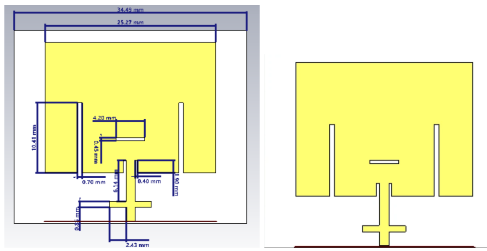
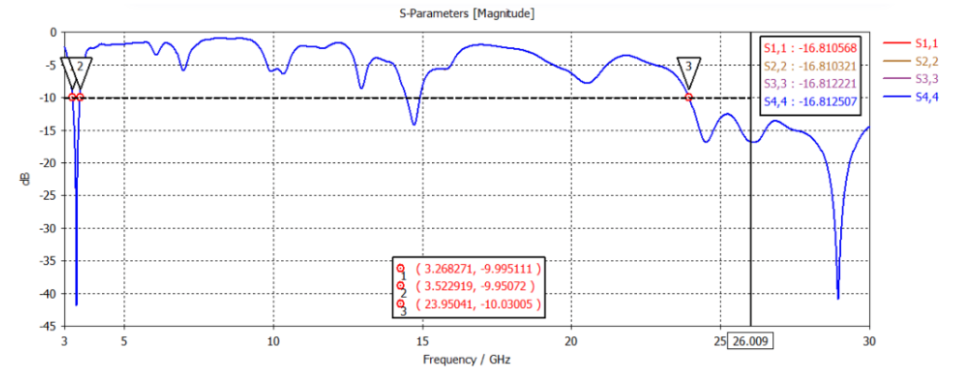
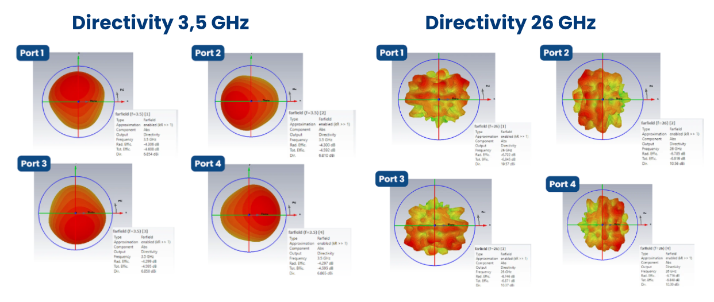
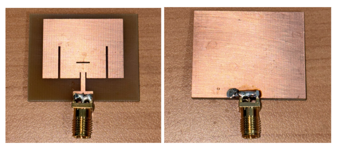

# 📡 Dual-Band 5G MIMO Antenna Design

A dual-band 2×2 MIMO microstrip antenna designed for 5G communication systems operating at **3.5 GHz** and **26 GHz** frequency bands. The project covers antenna design, simulation, optimization, and performance evaluation using CST Studio Suite.

---

## 🎯 Project Overview

This project focuses on the design and analysis of a dual-band microstrip antenna for future 5G wireless communication applications.

The design process began with a single-patch antenna configuration and was extended into a 2×2 MIMO antenna structure to improve system capacity and communication reliability. Antenna performance was evaluated through S-parameter analysis, gain measurement, directivity analysis, and radiation pattern observation.

---

## ✨ Key Features

- 📶 Dual-band operation at 3.5 GHz and 26 GHz
- 📡 2×2 MIMO microstrip antenna configuration
- 📉 Good impedance matching (S11 < -10 dB)
- 🚀 Improved gain performance at mmWave frequencies
- 🌐 Radiation pattern and directivity analysis
- 🛠️ Designed and optimized using CST Studio Suite
- 📱 Suitable for future 5G wireless communication systems

---

## 🖼️ Antenna Design

### Single Patch Antenna



### Final 2×2 MIMO Antenna


---

## 📊 Reflection Coefficient (S11)

The final antenna achieves dual-band resonance around 3.5 GHz and 26 GHz with acceptable impedance matching for both operating frequencies.



---

## 📈 Gain Performance

### Gain at 3.5 GHz

| Port | Gain (dBi) |
|--------|--------|
| Port 1 | 2.548 |
| Port 2 | 2.510 |
| Port 3 | 2.551 |
| Port 4 | 2.568 |

### Gain at 26 GHz

| Port | Gain (dBi) |
|--------|--------|
| Port 1 | 6.102 |
| Port 2 | 6.332 |
| Port 3 | 6.150 |
| Port 4 | 6.426 |

The antenna exhibits higher gain performance in the millimeter-wave band (26 GHz), making it suitable for high-data-rate 5G applications.

---

## 🌐 Radiation Pattern & Directivity

Radiation pattern and directivity characteristics were evaluated for all antenna ports at both operating frequencies.



### Key Observations

- 📡 Directional radiation characteristics at both frequency bands
- 📶 Consistent performance across all MIMO ports
- 🚀 Higher directivity achieved at 26 GHz compared to 3.5 GHz
- 📈 Suitable radiation characteristics for wireless communication applications

---
## ✅ Design Performance Summary

| Parameter | Target Specification | Simulation Result | Status |
|------------|---------------------|------------------|----------|
| Antenna Type | Dual-Band 2×2 MIMO Microstrip | Dual-Band 2×2 MIMO Microstrip | ✅ |
| Operating Frequency 1 | 3.3 – 3.6 GHz | 3.268 – 3.523 GHz | ✅ |
| Operating Frequency 2 | 24.5 – 28 GHz | Covers 26 GHz Band | ✅ |
| Substrate | FR-4 | FR-4 | ✅ |
| Dielectric Constant | εr = 4.3 | εr = 4.3 | ✅ |
| Substrate Thickness | 1.6 mm | 1.6 mm | ✅ |
| Return Loss | S11, S22, S33, S44 ≤ -10 dB | -16.81 dB at 26 GHz | ✅ |
| VSWR | ≤ 2 | ≤ 2 at 3.5 GHz & 26 GHz | ✅ |
| Polarization | Linear | Linear | ✅ |
| Radiation Pattern | Directional | Directional | ✅ |
| ECC | < 0.05 | < 0.01 | ✅ |
| Directivity (3.5 GHz) | > 6 dBi | 6.81 – 6.87 dBi | ✅ |
| Directivity (26 GHz) | > 10 dBi | 10.37 – 10.75 dBi | ✅ |
| Gain (3.5 GHz) | > 6 dBi | 2.51 – 2.57 dBi | ❌ |
| Gain (26 GHz) | > 6 dBi | 6.10 – 6.43 dBi | ✅ |

### Key Findings

- ✅ Successful dual-band operation at 3.5 GHz and 26 GHz.
- ✅ Good impedance matching with return loss below -10 dB.
- ✅ Low mutual coupling indicated by ECC < 0.01.
- ✅ Directional radiation characteristics achieved.
- ✅ Directivity targets satisfied at both operating frequencies.
- ⚠️ Gain requirement was achieved at 26 GHz but not at 3.5 GHz.
---
## 🔧 Fabricated Antenna

Fabricated prototype of the proposed antenna design.



---

## 📂 Simulation Files

Simulation models are provided in:

```text
simulation/
├── single_patch_antena_design.cst
└── MIMO_antena_design.cst
```

These CST files can be opened and modified using CST Studio Suite.

---

## 📚 Documentation

Project reports and presentation materials:

- 📄 [Final Report](docs/final_report.pdf)
- 📊 [Project Presentation](docs/project_presentation.pdf)

Click the links above to view or download the project documentation directly from GitHub.

Located in:

```text
docs/
├── final_report.pdf
└── project_presentation.pdf
```

---

## 🛠️ Software Used

- CST Studio Suite
- Microsoft Excel

---

## 📖 Research Areas

- Microstrip Antenna Design
- MIMO Antenna Systems
- 5G Wireless Communications
- Millimeter-Wave Communications
- RF Engineering

---

## 👥 Project Team

This project was developed as part of a group assignment in the Telecommunications Engineering course.

Team Members:
- Anindya Putri Defana
- Annisa Sheryl Tabina
- Drina Shahada Wibowo
